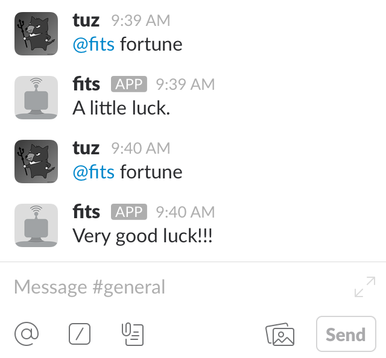

# slackbot
golang slackbot


## Description
Simple slackbot.

**Demo**




## Features
- Simple
- Easily import additional functions

## Requirements
- [nlopes's Slack API](https://github.com/nlopes/slack)

## Usage
```
$ go run slackbot.go
```
or
```
$ go build slackbot.go
$ ./slackbot
```

## Installation
1. Download
```
$ go get github.com/nlopes/slack
$ git clone https://github.com/tuz358/slackbot
```
2. Set your Slack API token around line 13 in slackbot.go
```
var API_TOKEN string = "SET-YOUR_API_TOKEN"
```

## Author
[tuz358](https://github.com/tuz358)

## License
[GPLv3](https://github.com/tuz358/slackbot/blob/master/LICENSE)
